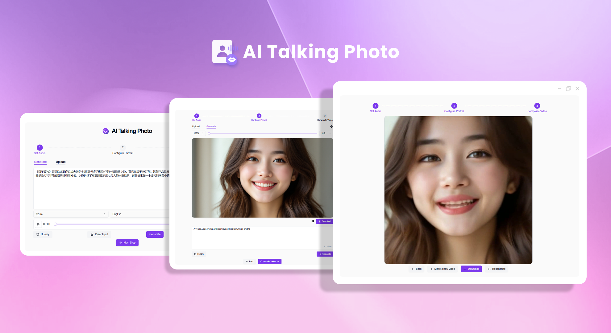
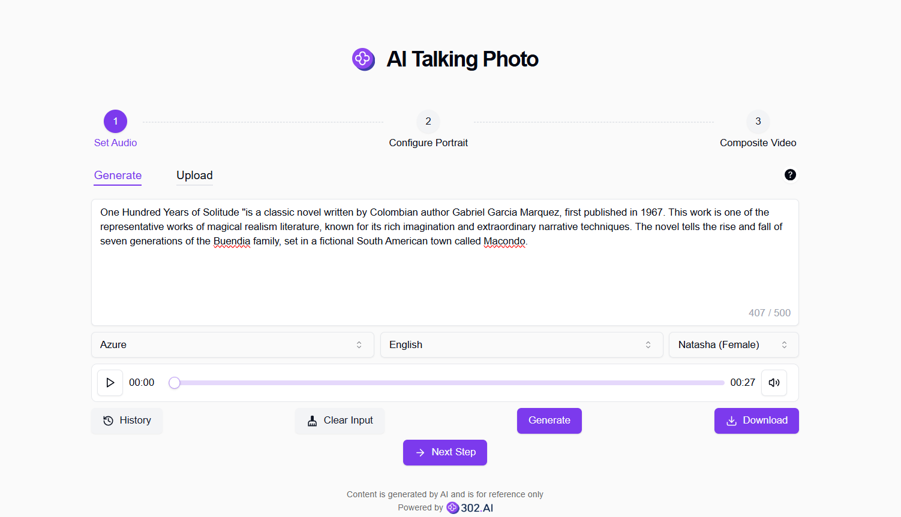
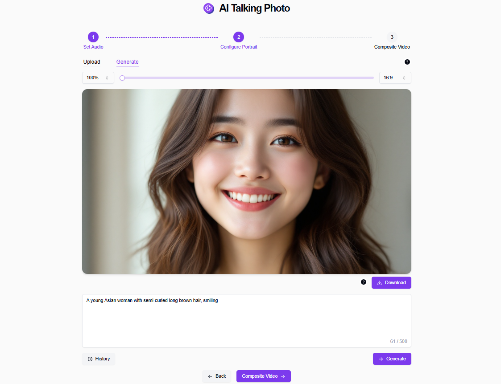
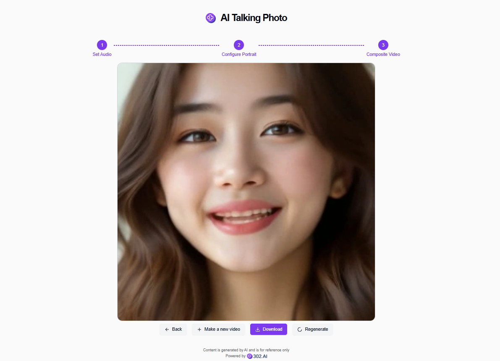

# 
📷 AI Talking Photo 🚀✨

By uploading the picture, the mouth shape is generated according to the submitted audio file and the video is synthesized to make the picture speak.

<a href="README_zh.md">中文</a> | <a href="README.md">English</a> | <a href="README_ja.md">日本語</a>

This is the open-source version of [AI Talking Photo](https://302.ai/en/tools/lipsync/) from [302.AI](https://302.ai/en/).
You can log in directly to 302.AI to use the online version with zero code and zero configuration.
Alternatively, you can modify this project according to your needs, input 302.AI's API KEY, and deploy it yourself.

## Interface Preview
You can input a text content that you want the photo to speak on the generation page, and you can choose a speech model and different speech packages to convert the text into an audio file; You can also choose to upload audio files directly on the upload page.
         

You can generate a portrait photo by entering a description of the photo on the generation page, or upload a clear frontal portrait directly on the upload page.
            

After clicking on the synthesized audio, it will start generating and finally obtain a video of a photo opening and "speaking" the audio.

## Project Features

### 📝 Multiple Audio and Photo Selection Methods

Supports uploading, generating, and recording audio and photos as input

### 📷 Supports Simple Photo Editing

- Supports aspect ratio adjustment
- Supports cropping

### 📜 History Record

Save your creation history so that nothing is forgotten, and you can download it anytime and anywhere.

### 🌐 Share Support

Share with one click to major social platforms.

### 🌓 Dark Mode

Support the dark mode to protect your eyes.

### 🌍 多言語サポート

- 中国語インターフェース
- 英語インターフェース
- 日本語インターフェース

## 🚩 Future Update Plans

- [ ] Add instant photo capture
- [ ] Add audio recording

## Tech Stack

- Next.js 14
- Tailwind CSS
- Shadcn UI

## Development & Deployment

1. Clone the project: `git clone https://github.com/302ai/302_lipsync`
2. Install dependencies: `pnpm install`
3. Configure environment variables: Refer to .env.example
4. Run the project: `pnpm run dev`
5. Build and deploy: `docker build -t lipsync . && docker run -p 3000:3000 lipsync`

## ✨ About 302.AI ✨

[302.AI](https://302.ai) is an enterprise-oriented AI application platform that offers pay-as-you-go services, ready-to-use solutions, and an open-source ecosystem.✨

1. 🧠 Comprehensive AI capabilities: Incorporates the latest in language, image, audio, and video models from leading AI brands.
2. 🚀 Advanced application development: We build genuine AI products, not just simple chatbots.
3. 💰 No monthly fees: All features are pay-per-use, fully accessible, ensuring low entry barriers with high potential.
4. 🛠 Powerful admin dashboard: Designed for teams and SMEs - managed by one, used by many.
5. 🔗 API access for all AI features: All tools are open-source and customizable (in progress).
6. 💡 Powerful development team: Launching 2-3 new applications weekly with daily product updates. Interested developers are welcome to contact us.
