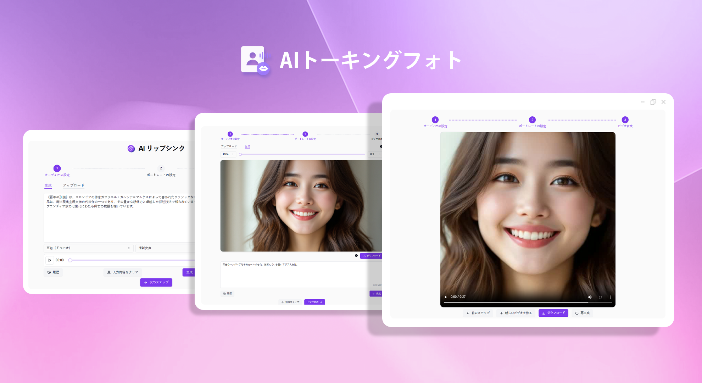
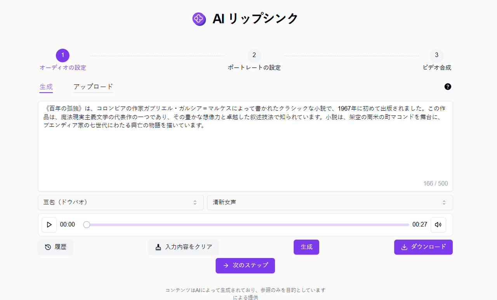
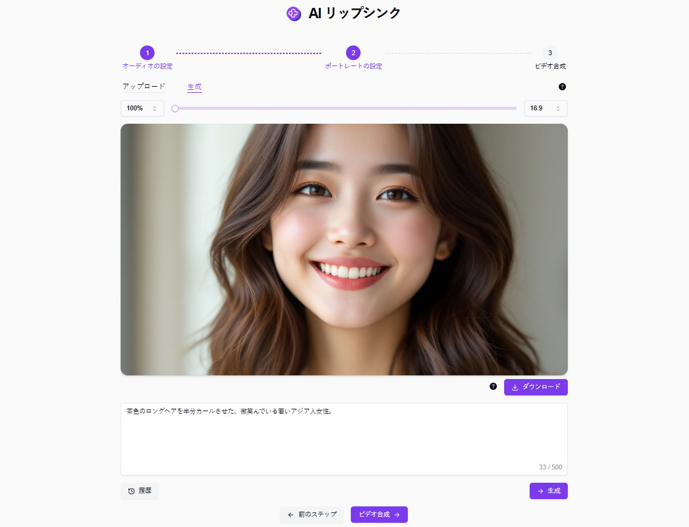
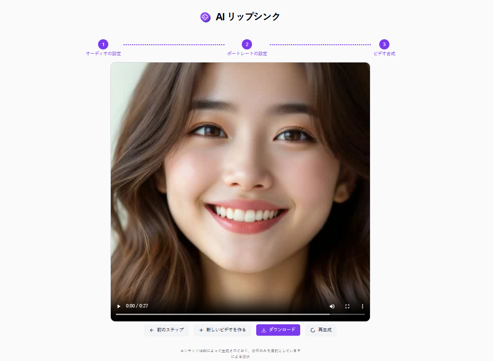

# 
📷 AIトーキングフォト 🚀✨

画像をアップロードすることで、提出された音声ファイルから口型を生成して動画を合成し、写真を口にして話すことを実現します。

<a href="README_zh.md">中文</a> | <a href="README.md">English</a> | <a href="README_ja.md">日本語</a>

[302.AI](https://302.ai/ja/)の[AIトーキングフォト](https://302.ai/ja/tools/lipsync/)のオープンソースバージョン。
302.AIに直接ログインして、コードやコンフィグレーション不要でオンラインバージョンを使用できます。
または、このプロジェクトを自分のニーズに合わせて変更し、302.AIのAPIキーを使用して独自にデプロイすることができます。

## インターフェースプレビュー
生成ページに写真の開口部に言いたいテキストの内容を入力することができ、音声モデルと異なる音声パッケージを選択してテキストをオーディオファイルに変換することができ、アップロードページで直接オーディオファイルを選択してアップロードすることもできます。
         

生成ページでは、写真の説明を入力することで人物写真を生成することも、アップロードページでははっきりした正面人物像を直接アップロードすることもできます。
               

合成音声をクリックして生成を開始すると、最後に写真の開口部で音声を「話す」ビデオが得られます。

## プロジェクトの特徴

### 📝 多くの音声、写真選択方法

アップロード、生成、録音された音声と写真を入力としてサポート

### 📝 簡単な写真編集をサポート

- アスペクト比の調整をサポート
- クロップをサポート

### 📜 履歴記録

あなたの創作履歴を保存し、記憶が失われることがなく、いつでもどこでもダウンロードできます。

### 🌐 共有サポート

1 クリックで主要なソーシャルプラットフォームに共有できます。

### 🌓 ダークモード

ダークモードをサポートし、あなたの目を保護します。

### 🌍 多言語サポート

- 中国語インターフェース
- 英語インターフェース
- 日本語インターフェース

## 🚩 将来のアップデート計画

- [ ] 写真の即時撮影を追加
- [ ] 音声録音を追加

## 技術スタック

- Next.js 14
- Tailwind CSS
- Shadcn UI

## 開発&デプロイ

1. プロジェクトをクローン: `git clone https://github.com/302ai/302_lipsync`
2. 依存関係をインストール: `pnpm install`
3. 環境変数を設定: .env.example を参照
4. プロジェクトを実行: `pnpm run dev`
5. ビルドとデプロイ: `docker build -t lipsync . && docker run -p 3000:3000 lipsync`

## ✨ 302.AIについて ✨

[302.AI](https://302.ai)は企業向けのAIアプリケーションプラットフォームであり、必要に応じて支払い、すぐに使用できるオープンソースのエコシステムです。✨

1. 🧠 包括的なAI機能：主要AIブランドの最新の言語、画像、音声、ビデオモデルを統合。
2. 🚀 高度なアプリケーション開発：単なるシンプルなチャットボットではなく、本格的なAI製品を構築。
3. 💰 月額料金なし：すべての機能が従量制で、完全にアクセス可能。低い参入障壁と高い可能性を確保。
4. 🛠 強力な管理ダッシュボード：チームやSME向けに設計 - 一人で管理し、多くの人が使用可能。
5. 🔗 すべてのAI機能へのAPIアクセス：すべてのツールはオープンソースでカスタマイズ可能（進行中）。
6. 💪 強力な開発チーム：大規模で高度なスキルを持つ開発者集団。毎週2-3の新しいアプリケーションをリリースし、毎日製品更新を行っています。才能ある開発者の参加を歓迎します。
