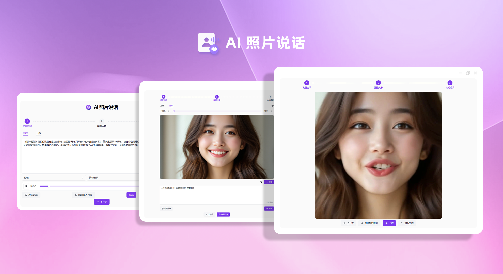
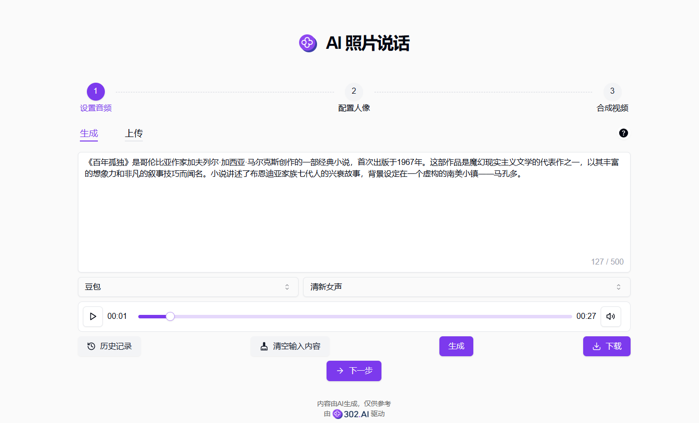
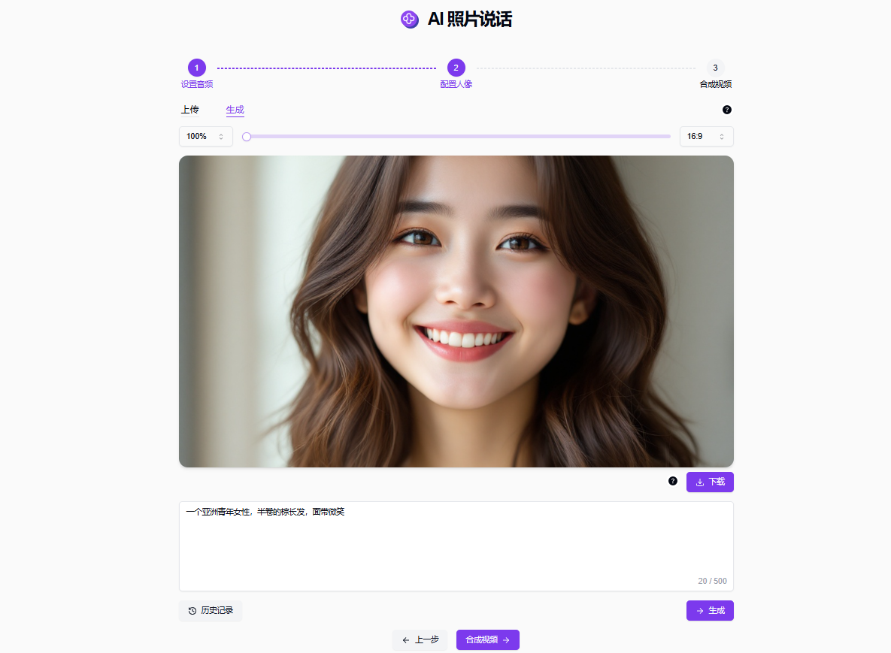
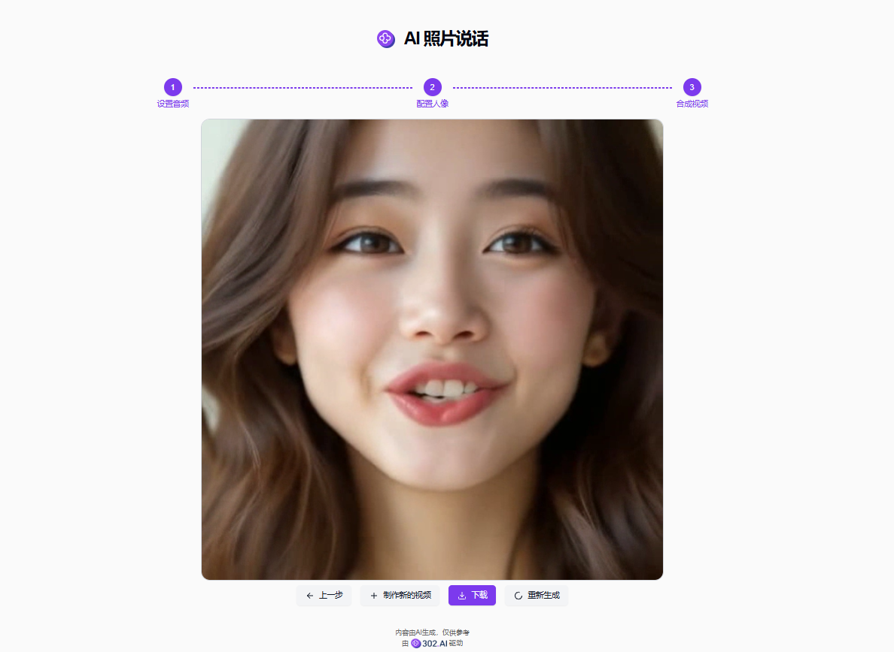

# 
📷 AI 照片说话 🚀✨

通过上传图片，根据提交的音频文件生成口型并合成视频，实现让照片开口说话。

<a href="README_zh.md">中文</a> | <a href="README.md">English</a> | <a href="README_ja.md">日本語</a>

来自[302.AI](https://302.ai)的[AI 照片说话](https://302.ai/tools/lipsync/)的开源版本。
你可以直接登录302.AI，零代码零配置使用在线版本。
或者对本项目根据自己的需求进行修改，传入302.AI的API KEY，自行部署。

## 界面预览
可在生成页输入一段希望照片开口说出的文本内容，可以选择语音模型和不同语音包将文本转化成音频文件；也可以在上传页直接选择音频文件上传。
          

可在生成页通过输入对照片的描述来生成一张人物照片，也可以在上传页直接上传一张清晰的正面人像。
         

点击合成音频后开始生成，最后可得到一段照片开口将音频“说出”的视频。

## 项目特性

### 📝 多种音频、照片选择方式

支持上传、生成，录制音频和照片作为输入

### 📷 支持照片的简易编辑

- 支持调整比例
- 支持裁剪

### 📜 历史记录

保存您的创作历史,记忆不丢失，随时随地都可以下载。

### 🌐 支持分享

一键分享到各大社交平台。

### 🌓 暗色模式

支持暗色模式，保护您的眼睛。

### 🌍 多语言支持

- 中文界面
- English Interface
- 日本語インターフェース

## 🚩 未来更新计划

- [ ] 添加照片即时拍摄
- [ ] 添加音频录制

## 技术栈

- Next.js 14
- Tailwind CSS
- Shadcn UI

## 开发&部署

1. 克隆项目 `git clone https://github.com/302ai/302_lipsync`
2. 安装依赖 `pnpm install`
3. 配置302的API KEY 参考.env.example
4. 运行项目 `pnpm run dev`
5. 打包部署 `docker build -t lipsync . && docker run -p 3000:3000 lipsync`

## ✨ 302.AI介绍 ✨

[302.AI](https://302.ai)是一个面向企业的AI应用平台，按需付费，开箱即用，开源生态。✨

1. 🧠 集合了最新最全的AI能力和品牌，包括但不限于语言模型、图像模型、声音模型、视频模型。
2. 🚀 在基础模型上进行深度应用开发，我们开发真正的AI产品，而不是简单的对话机器人
3. 💰 零月费，所有功能按需付费，全面开放，做到真正的门槛低，上限高。
4. 🛠 功能强大的管理后台，面向团队和中小企业，一人管理，多人使用。
5. 🔗 所有AI能力均提供API接入，所有工具开源可自行定制（进行中）。
6. 💡 强大的开发团队，每周推出2-3个新应用，产品每日更新。有兴趣加入的开发者也欢迎联系我们
